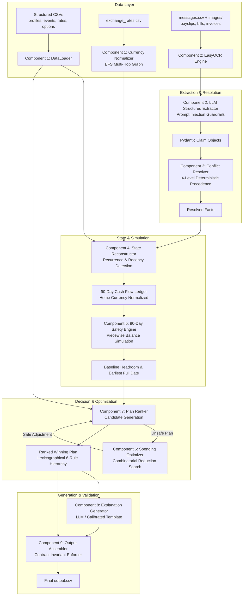
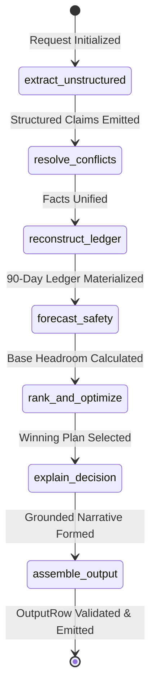

# Buy or Wait? — AI Financial Decision Agent

[](https://www.python.org/downloads/)
[](https://github.com/langchain-ai/langgraph)
[](https://github.com/langchain-ai/langchain)
[](https://www.hackerrank.com/contests/hackerrank-orchestrate-september26/challenges/buy-or-wait)

A production-grade, autonomous financial decision system built for the **HackerRank Orchestrate** hackathon challenge: **Buy or Wait?**. 

The system analyzes personal financial profiles, transaction histories, multi-currency cash flows, provider payment options, and unstructured supporting evidence (messages and image documents) to deliver personalized, financially safe affordability recommendations.

---

## Table of Contents

1. [Quick Start: Clone & Run](#quick-start-clone--run)
   - [Prerequisites](#prerequisites)
   - [Setup Instructions](#setup-instructions)
   - [Execution Commands](#execution-commands)
   - [Running Tests & Evaluation](#running-tests--evaluation)
2. [Problem Statement](#problem-statement)
   - [The Core Challenge](#the-core-challenge)
   - [Input Data Streams](#input-data-streams)
   - [Required Output Contract](#required-output-contract)
   - [Financial Safety Rules](#financial-safety-rules)
3. [System Architecture](#system-architecture)
   - [End-to-End Pipeline Diagram](#end-to-end-pipeline-diagram)
   - [LangGraph StateGraph Workflow](#langgraph-stategraph-workflow)
4. [Component Deep Dive & Design Decisions](#component-deep-dive--design-decisions)
   - [Component 0: LLM Client & Usage Tracker](#component-0-llm-client--usage-tracker)
   - [Component 1: Data Loader & Currency Normalizer](#component-1-data-loader--currency-normalizer)
   - [Component 2: Unstructured Extraction (OCR + LLM)](#component-2-unstructured-extraction-ocr--llm)
   - [Component 3: Conflict Resolution Engine](#component-3-conflict-resolution-engine)
   - [Component 4: State Reconstruction & Recurrence Detection](#component-4-state-reconstruction--recurrence-detection)
   - [Component 5: 90-Day Forecast & Safety Engine](#component-5-90-day-forecast--safety-engine)
   - [Component 6: Spending-Change Optimizer](#component-6-spending-change-optimizer)
   - [Component 7: Plan Ranker](#component-7-plan-ranker)
   - [Component 8: Explanation Generation](#component-8-explanation-generation)
   - [Component 9: Output Assembler & Contract Validator](#component-9-output-assembler--contract-validator)
   - [Component 10: Evaluation Harness](#component-10-evaluation-harness)
5. [Repository Structure](#repository-structure)
6. [Submission Artifacts](#submission-artifacts)

---

## Quick Start: Clone & Run

### Prerequisites

- **Operating System**: Linux / macOS / Windows WSL
- **Python Runtime**: Python 3.12 (recommended)
- **Virtual Environment Tool**: `venv` or `conda`
- **Optional API Key**: `EXPLABS_API_KEY` for LLM structured extraction and explanation generation. *(Note: The system contains a complete deterministic fallback engine and runs out of the box even without an API key).*

### Setup Instructions

```bash
# 1. Clone the repository
git clone https://github.com/interviewstreet/hackerrank-orchestrate-september26.git
cd hackerrank-orchestrate-september26

# 2. Create and activate a Python 3.12 virtual environment
python3.12 -m venv .venv
source .venv/bin/activate

# 3. Install dependencies
pip install --upgrade pip
pip install -r code/requirements.txt

# 4. (Optional) Configure environment variables
# Copy template or export directly:
export EXPLABS_API_KEY="your-api-key-here"
```

### Execution Commands

```bash
# Production Run: Generate final predictions for all 250 evaluation requests
cd code
python3 main.py --dataset-dir ../dataset --output-csv ../output.csv

# Deterministic Mode (Pure rule-based, no external LLM calls)
python3 main.py --dataset-dir ../dataset --output-csv ../output.csv --no-llm

# Benchmark Run: Evaluate against the 25 sample requests with ground truth
python3 main.py --dataset-dir ../dataset --requests-file ../dataset/sample_requests.csv --output-csv /tmp/sample_output.csv --evaluate
```

### Running Tests & Evaluation

```bash
# Run the automated unit test suite (deterministic, zero external calls)
PYTHONPATH=code python3 -m unittest discover -s code/tests -p "test_*.py"
```

---

## Problem Statement

### The Core Challenge

When a user asks: **"Can I afford to purchase this item today?"**, traditional banking tools often check only the current ledger balance. However, real financial safety depends on forward-looking commitments:
- What recurring expenses (rent, loan repayments, utility bills, subscriptions) are due over the next 90 days?
- What confirmed salary is expected, and when will it settle?
- What pending authorizations have already been reserved?
- What seller installment plans are available, and do they violate the user's constraints?
- What is the user's personal `minimum_balance_to_keep`?

The agent must make an optimal, personalized decision: **pay in full now**, **pay with an installment plan**, **pay partially today and remainder later**, **wait for a specific future date**, or **do not proceed**.

### Input Data Streams

The system reconstructs the user's complete financial state from 8 data files in `dataset/`:

| Dataset File | Role & Contents |
|---|---|
| `requests.csv` | 250 evaluation purchase requests (`request_id`, `user_id`, `request_date`, `requested_amount`, `desired_completion_date`, `allows_partial_payment`). |
| `sample_requests.csv` | 25 calibration examples with completed ground-truth decision fields. |
| `financial_profiles.csv` | User constraints: `home_currency`, `current_available_balance`, `minimum_balance_to_keep`, protected categories, flexible categories, payment preferences, `max_installment_months`. |
| `financial_events.csv` | ~25,342 transaction records spanning historical settled, scheduled, pending, cancelled, failed, and non-cash entries. |
| `exchange_rates.csv` | 134 fixed, dated exchange rates covering 39 dates for INR, ZAR, IDR, USD, and EUR. |
| `request_payment_options.csv` | 790 merchant/provider financing options (`payment_method`, `first_payment_date`, `payment_frequency_days`, `number_of_payments`, `financing_fee`). |
| `messages.csv` | 215 communication records from banks, employers, service providers, and merchants. |
| `images.csv` & `media/images/` | 16 financial document images (payslips, utility bills, invoices, receipts). |

### Required Output Contract

For every request, the engine produces exactly one output row in `output.csv` with these 8 strictly ordered columns:

```text
request_id,amount_safe_to_pay,affordability_status,recommended_payment_method,payment_plan,earliest_date_for_full_payment,spending_changes_needed,decision_explanation
```

- **`amount_safe_to_pay`**: Largest amount safe to pay on `request_date` *before* optional spending changes ($0 \le \text{amount} \le \text{requested\_amount}$).
- **`affordability_status`**: One of `affordable_now`, `affordable_with_plan`, `affordable_later`, or `not_affordable`.
- **`recommended_payment_method`**: One of `full_payment`, `partial_payment`, `installments`, `wait`, or `not_recommended`.
- **`payment_plan`**: Chronological `YYYY-MM-DD:amount` entries separated by `|`, or `none`.
  - For `partial_payment`: Exactly two payments summing to `requested_amount` (`amount_safe_to_pay` on `request_date`, remainder on `earliest_date_for_full_payment`).
  - For `installments`: Exactly matches a supplied provider option.
- **`earliest_date_for_full_payment`**: First conservative date within the 90-day window where paying 100% in full maintains balance $\ge \text{minimum\_balance\_to\_keep}$. Equals `request_date` for `affordable_now`. Empty if never safe in the window.
- **`spending_changes_needed`**: `none` or up to 3 `stop:<event_id>` and `reduce_to:<event_id>:<amount>` actions on flexible, user-permitted categories.
- **`decision_explanation`**: Terse, grounded English justification matching the calibration style.

### Financial Safety Rules

1. **Conservative Horizon**: Fixed to $[request\_date, request\_date + 90\text{ days}]$. No extrapolation beyond day 90.
2. **Cash State Accounting**:
   - Pending debits are reserved as committed outflows on settlement date.
   - Pending credits, bonuses, refunds, lottery wins, and investment gains are **ignored** until settled.
   - Confirmed salary is recognized on its settlement date.
   - Non-cash valuation updates and failed/cancelled records are completely excluded.
3. **Strict Minimum Balance Floor**: After every projected expense and recommended payment, the balance must never drop below `minimum_balance_to_keep`.

---

## System Architecture

### End-to-End Pipeline Diagram



### LangGraph StateGraph Workflow

The execution is coordinated using a compiled **LangGraph `StateGraph`** where each request traverses a linear topological state graph:



---

## Component Deep Dive & Design Decisions

### Component 0: LLM Client & Usage Tracker
* **Location**: `code/llm_client/client.py`, `code/llm_client/usage_tracker.py`
* **Purpose**: Manages OpenAI-compatible LLM interactions via LangChain `ChatOpenAI` targeting the Experiential Labs gateway (`https://api.experientiallabs.ai/v1`, model `gpt-5.6-luna`).
* **Design Decisions**:
  - **Structured Outputs via Schema**: Uses LangChain's `.with_structured_output(Claim, include_raw=True)` to guarantee typed Pydantic instances while extracting raw token usage directly from message metadata.
  - **In-Memory Caching**: Caches structured extraction responses by `(source_id, prompt_version)` to eliminate duplicate API calls for users with shared messages.
  - **Observability**: Automatically logs call type, token consumption, and latency per request, generating `evaluation/usage_report.md` fulfilling challenge requirements (§6.5).

### Component 1: Data Loader & Currency Normalizer
* **Location**: `code/loaders/data_loader.py`, `code/currency/converter.py`
* **Purpose**: Fast in-memory parsing of all CSV datasets and multi-hop currency conversion.
* **Design Decisions**:
  - **Natural Key Indices**: Builds primary dictionary lookups and secondary grouped indices (`events_by_user`, `payment_options_by_request`, `images_by_event`) providing $O(1)$ access during graph traversal.
  - **BFS Multi-Hop Conversion**: Currency pairs (e.g., ZAR to INR) often lack direct rates. The normalizer models dated rates as a directed graph with forward and inverse ($1/\text{rate}$) edges, using Breadth-First Search (BFS) to find the shortest conversion path across intermediary currencies (e.g., $\text{ZAR} \to \text{EUR} \to \text{USD} \to \text{INR}$).
  - **Date Fallback Strategy**: If a cash flow settles on a weekend or date without published exchange rates, it performs an outward radial search to locate the nearest date with a valid graph path, logging all fallbacks for auditability.

### Component 2: Unstructured Extraction (OCR + LLM)
* **Location**: `code/extraction/ocr.py`, `code/extraction/llm_extractor.py`, `code/extraction/claim.py`
* **Purpose**: Converts unstructured messages and image documents into structured financial claims.
* **Design Decisions**:
  - **Prompt Injection Defense**: All untrusted text (user messages, OCR output) is strictly isolated inside `[DATA_START]` and `[DATA_END]` delimiters with system instructions to treat enclosed content purely as data to classify, never as assistant directives.
  - **Document Disambiguation Rules**: Enforces domain-specific financial heuristics:
    - *Payslips*: Extracts the **Net Pay** figure (post-tax/deductions), rejecting gross pay.
    - *Invoices / Bills*: Extracts the **Balance Due / Amount Due**, avoiding amounts paid or received.
  - **Lazy OCR Loading**: Initializes `easyocr.Reader` lazily on first image encounter to keep startup instantaneous for text-only workflows.

### Component 3: Conflict Resolution Engine
* **Location**: `code/resolution/conflict_resolver.py`
* **Purpose**: Reconciles contradictory claims targeting the same event or financial field into a single canonical fact.
* **Design Decisions**:
  - **Deterministic 4-Level Precedence**:
    1. *Action Type*: Explicit amendments, cancellations, and settled confirmations win over general delays or confirmations.
    2. *Recency*: The newest record by `source_date` / `sent_at` timestamp wins across all sources.
    3. *Cash Reality*: A settled transaction outranks an unconfirmed estimate.
    4. *Conservative Financial Safety (Tie-Breaker)*: If ambiguity persists, the engine picks the safer financial interpretation:
       - Expenses: higher amount, earlier date.
       - Income: lower amount, later date.
  - **Invalid Claim Discard**: Discards claims referencing nonexistent event IDs or unauthorized fields before resolution.

### Component 4: State Reconstruction & Recurrence Detection
* **Location**: `code/state/recurrence.py`
* **Purpose**: Constructs the chronologically ordered cash-flow ledger for the 90-day simulation window.
* **Design Decisions**:
  - **Description-Aware Grouping for Discretionary Spending**: To prevent irregular, discretionary transactions (e.g. 26 separate grocery trips) from being lumped into artificial weekly recurring debits, variable categories (`groceries`, `transport`, `dining`) are grouped by `(category, description, direction)`. Fixed commitments (`rent`, `utilities`, `subscriptions`, `debt_repayment`) are grouped at category level.
  - **Liveness Recency Gating**: Rejects dormant recurring series: if the last occurrence occurred $> 1.5 \times \text{interval}$ prior to `request_date`, the series is marked inactive and excluded from forward projections.
  - **Salary Continuation**: Anchors to the explicit confirmed future salary event and projects subsequent monthly cycles (+30 days) across the remainder of the 90-day horizon per SOLUTION.md §7.

### Component 5: 90-Day Forecast & Safety Engine
* **Location**: `code/forecast/safety_engine.py`
* **Purpose**: Simulates daily balance trajectories and computes baseline headroom.
* **Design Decisions**:
  - **Piecewise-Constant Event Granularity**: Because account balances remain constant between transaction dates, the engine simulates trajectory points only on event settlement dates, reducing computation by 90% while remaining mathematically exact.
  - **Strict Headroom Formula**: Evaluated strictly *before* optional spending changes:
    $$\text{amount\_safe\_to\_pay} = \min\left(\text{requested\_amount}, \max(0, \min_{t \in [T_0, T_{90}]}(\text{balance}(t)) - \text{minimum\_balance\_to\_keep})\right)$$
  - **Plan Safety Verifier**: Provides an exact simulation verifier (`is_plan_safe`) that tests multi-stage payment plans (installments / partial payments) against the user's minimum balance floor.

### Component 6: Spending-Change Optimizer
* **Location**: `code/optimizer/spending_optimizer.py`
* **Purpose**: Identifies minimal spending reductions or stops to unlock plan affordability when a purchase is not safe as-is.
* **Design Decisions**:
  - **User Permission Enforcing**: Strictly respects `expense_categories_to_protect` (never touched) and checks category membership against `expense_categories_user_is_willing_to_reduce` and `...willing_to_stop`.
  - **Less Drastic First**: Prioritizes `reduce_to` over `stop`. Reductions are floored at `minimum_allowed_amount`.
  - **Combinatorial Pruning**: Explores combinations of 1, 2, and up to 3 actions with mutual exclusivity per `event_id` (an event is never both stopped and reduced).

### Component 7: Plan Ranker
* **Location**: `code/ranking/plan_ranker.py`
* **Purpose**: Generates candidate payment methods and selects the winning recommendation.
* **Design Decisions**:
  - **Candidate Generation**: Evaluates `full_payment`, `wait`, `partial_payment` (allowed only if `allows_partial_payment=True` and $0 < \text{safe\_today} < \text{requested}$), and valid merchant installment plans matching `max_installment_months`.
  - **Lexicographical 6-Rule Hierarchy**:
    1. Completes by `desired_completion_date`.
    2. Requires no spending changes (0 changes beats 1+).
    3. Minimizes `total_payable_amount` (penalizes financing fees).
    4. Starts payment earlier.
    5. Uses fewer payments.
    6. Lowest `payment_option_id` as final tie-breaker.

### Component 8: Explanation Generation
* **Location**: `code/explanation/explain_llm.py`
* **Purpose**: Emits terse, natural English decision narratives.
* **Design Decisions**:
  - **Strict Structured Summary Feed**: The LLM prompt receives only fully-computed structured numbers and dates (never raw user prompts or unparsed text), completely eliminating hallucination or goal-hijacking vectors.
  - **Few-Shot Calibration**: Grounded directly in `sample_requests.csv` style patterns (e.g., *"Pay ZAR 25,256 today. This leaves at least ZAR 18,000 available over the next 90 days."*).
  - **Dual-Mode Deterministic Fallback**: If LLM execution is disabled or network fails, an internal template engine emits identical calibrated phrases.

### Component 9: Output Assembler & Contract Validator
* **Location**: `code/output/validator.py`
* **Purpose**: Enforces all competition invariants and writes `output.csv`.
* **Design Decisions**:
  - **Invariant Assertions**: Verifies bounds, date formats, partial payment sums ($P_1 + P_2 = \text{requested}$), chronological order, and mutual exclusivity of spending changes.
  - **Conservative Fail-Safe**: If any invariant check fails, the row automatically falls back to safe default values (`not_affordable`, `not_recommended`, `amount_safe_to_pay=0`, `payment_plan=none`), ensuring no malformed row ever corrupts the submission.

### Component 10: Evaluation Harness
* **Location**: `code/evaluation/harness.py`
* **Purpose**: Benchmarking against ground-truth sample requests.
* **Design Decisions**:
  - **Tolerance-Aware Matching**: Evaluates categorical fields exactly, allows $\pm 1.0$ numerical tolerance on currency amounts, and compares payment plans by parsing date-amount sets rather than fragile string equality.
  - **Disjoint ID Guardrail**: Detects and warns if zero IDs overlap between input predictions and sample ground truth.

---

## Repository Structure

```text
hackerrank-orchestrate-september26/
├── AGENTS.md                         # Rules for AI coding tools + transcript logging
├── problem_statement.md              # Official challenge specification
├── README.md                         # Comprehensive project documentation
├── output.csv                        # Final generated predictions (evaluation run)
├── MEMORY.md                         # Agent state & implementation memory
├── log.txt                           # Conversation turn audit log (per AGENTS.md)
├── code/
│   ├── main.py                       # CLI entry point & LangGraph StateGraph orchestrator
│   ├── requirements.txt              # Project dependencies
│   ├── README.md                     # Code-level instructions
│   ├── llm_client/                   # Component 0: ChatOpenAI wrapper & UsageTracker
│   │   ├── client.py
│   │   └── usage_tracker.py
│   ├── loaders/                      # Component 1: CSV loader & typed dataclass models
│   │   └── data_loader.py
│   ├── currency/                     # Component 1: BFS multi-hop currency converter
│   │   └── converter.py
│   ├── extraction/                   # Component 2: EasyOCR & structured LLM claim extractor
│   │   ├── claim.py
│   │   ├── ocr.py
│   │   └── llm_extractor.py
│   ├── resolution/                   # Component 3: 4-level conflict resolver
│   │   └── conflict_resolver.py
│   ├── state/                        # Component 4: State reconstruction & recurrence engine
│   │   └── recurrence.py
│   ├── forecast/                     # Component 5: 90-day balance simulation & safety engine
│   │   └── safety_engine.py
│   ├── optimizer/                    # Component 6: Spending-change combinatorial optimizer
│   │   └── spending_optimizer.py
│   ├── ranking/                      # Component 7: Multi-criteria plan ranker
│   │   └── plan_ranker.py
│   ├── explanation/                  # Component 8: Factual explanation generator
│   │   └── explain_llm.py
│   ├── output/                       # Component 9: Contract validator & CSV assembler
│   │   └── validator.py
│   ├── evaluation/                   # Component 10: Benchmark harness & token report
│   │   ├── harness.py
│   │   └── usage_report.md
│   └── tests/                        # Automated unit test suite
│       └── test_pipeline.py
└── dataset/
    ├── requests.csv                  # 250 evaluation requests
    ├── sample_requests.csv           # 25 solved calibration examples
    ├── financial_profiles.csv        # Balances, minimums, preferences
    ├── financial_events.csv          # Transaction records
    ├── request_payment_options.csv   # Merchant financing options
    ├── exchange_rates.csv            # Dated currency rates
    ├── messages.csv                  # Evidence messages
    ├── images.csv                    # Document metadata
    ├── output.csv                    # Blank template
    └── media/images/                 # PNG document images
```

---

## Submission Artifacts

Per §6.5 of the challenge rules, the submission package comprises:
1. **`output.csv`**: Contains exactly 250 prediction rows for `dataset/requests.csv` with the required 8 columns.
2. **`code.zip`**: Complete runnable source tree including `code/evaluation/usage_report.md` summarizing model calls, token metrics, and cost estimates.
3. **`chat_transcript`**: Chronological agent conversation record.

---

### Challenge Submission Link
To submit your final solution, navigate to:
**https://www.hackerrank.com/contests/hackerrank-orchestrate-september26/challenges/buy-or-wait/submission**
